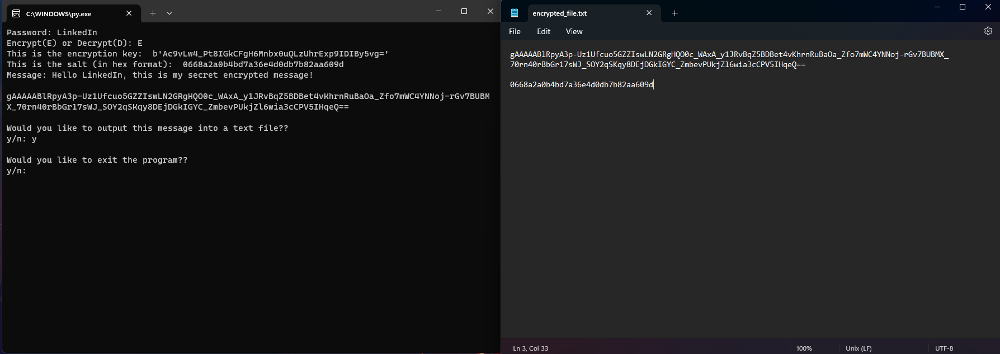

# Python Password Encryption CLI



A simple command-line tool written in Python that lets you **encrypt and decrypt messages using a password**.  
It uses PBKDF2 (with SHA-256) to derive a key from your password and then encrypts the message using `Fernet` from the `cryptography` library.

> ⚠️ This project is for **learning and personal use**.  
> For production-grade security, get a professional security review before relying on it.

---

## Features

- 🔐 Password-based encryption and decryption
- 🧂 Random 16-byte salt generated for each encryption
- 🔑 Key derivation using PBKDF2HMAC (SHA-256, 100,000 iterations)
- 📄 Optional output to `encrypted_file.txt` with:
  - `Message: <encrypted_message>`
  - `Salt: <salt_in_hex>`
- 🖥️ Interactive CLI prompts for a smooth workflow

---

## Requirements

- Python 3.8+
- [`cryptography`](https://cryptography.io/) library

Install dependencies with:

```bash
pip install cryptography
```

---

## Usage

1. **Clone the repository**

   ```bash
   git clone https://github.com/<your-username>/python-password-encryption-cli.git
   cd python-password-encryption-cli
   ```

2. **Run the script**

   ```bash
   python password_encryption_cli.py
   ```

---

## Encrypting a message

1. Enter your **password** (must not be empty).
2. Choose **Encrypt (E)** when prompted.
3. Type the **message** you want to encrypt.
4. The script will print:
   - The derived encryption key
   - The salt (in hex)
   - The encrypted message (a long base64 string)
5. Optionally choose `y` to save to **`encrypted_file.txt`**.  
   The file will contain:

   ```text
   Message: <encrypted_message>

   Salt: <salt_in_hex>
   ```

6. Optionally choose to exit the program or continue with another operation.

> 💡 To decrypt later, you must keep the **encrypted message**, the **salt**, and remember the **password**.

---

## Decrypting a message

1. Enter the **same password** you used for encryption.
2. Choose **Decrypt (D)**.
3. Paste the **salt in hex** (shown during encryption or stored in `encrypted_file.txt`).
4. Paste the **encrypted message** (the base64 string).
5. If everything matches, you’ll see:

   ```text
   Valid Key - Successfully decrypted
   Decrypted message: <your original text>
   ```

If the password, salt, or message is wrong, you’ll get:

```text
Invalid Key - Unsuccessfully decrypted
```

and the program will exit.

---

## Notes

- The script uses `os.urandom(16)` to generate a 16-byte salt per encryption.
- Key derivation is done with:

  ```python
  PBKDF2HMAC(
      algorithm=hashes.SHA256(),
      length=32,
      salt=salt,
      iterations=100000,
      backend=default_backend()
  )
  ```

- `os.startfile('encrypted_file.txt')` is **Windows-specific**.  
  On macOS/Linux you can comment out that line or replace it with the appropriate command.

---

## Credits

This project was inspired by:

- YouTube: [Encryption and Decryption in Python](https://www.youtube.com/watch?v=H8t4DJ3Tdrg)
- Blog post: [Encryption and Decryption in Python – Nitratine](https://nitratine.net/blog/post/encryption-and-decryption-in-python/)
